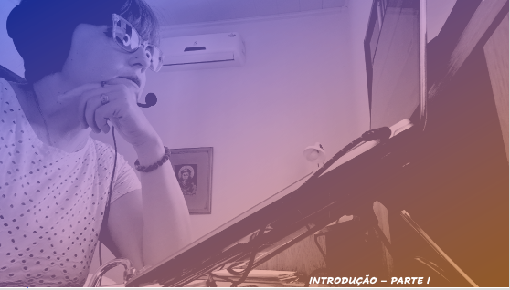
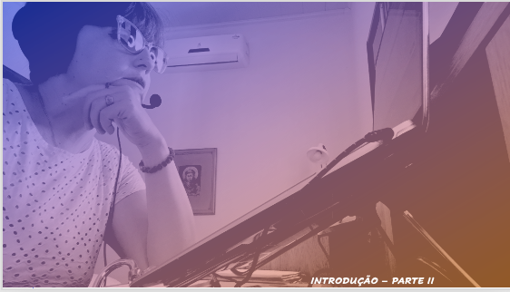

# Aula 01 - Interface Homem-Computador
## Tema aula - Apresentação Disciplina e Introdução com o impacto das TIC no cotidiano

### Materiais
- [Notas de aula Introdução Interface Homem-Computador](aula_introducao.pdf)

### Videoaulas interface Homem-Computador -  Introdução - Parte I e Parte II

####  O vídeo abaixo é sobre a importância de uma interface que satisfaça as necessidades dos usuários

### Desenvolvimento Aula Introdução: 

- [ ]  O impacto das TIC no cotidiano
- [ ]  Como as TIC se inserem em várias áreas e o impacto na vida de cada um. Pensar como seria sem a presença das TIC.
- [ ]  Pensar sobre o cenário de pandemia e como as TIC aproximaram as pessoas que tinham que ficar isoladas.
- [ ]  Observar a mudança de interface da votação escrita para urna eletrônica, por exemplo.
- [ ]  Diferentes visões sobre a construção de sistemas interativos
- [ ]  O que é interação?
- [ ]  O que é interface?
- [ ]  Desenvolvimento DE DENTRO PARA FORA e DE FORA PARA DENTRO. Qual a diferença entre desenvolver um sistema que se preocupa com os usuários?
- [ ]  Objetos de estudo em IHC
- [ ]  IHC como área multidisciplinar
- [ ]  Benefícios de  IHC
- [ ]  Discussão em sala de aula sobre o uso de TVDI para assistir um jogo
- [ ]  Atividade AVA sobre pagamento de contas em caixa eletrônico ou no computador.
