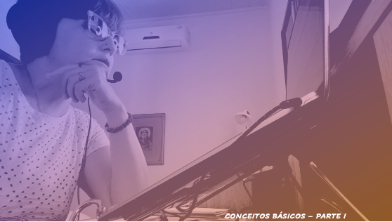

# Aula 02 - Interface Homem-Computador
## Tema aula - Conceitos Básicos IHC

### Materiais
- [Notas de aula Conceitos Básicos - Parte I](conceitos_basicos_parteI.pdf)
- [Notas de aula Conceitos Básicos - Parte II](conceitos_basicos_parteII.pdf)

### Videoaulas interface Homem-Computador -  Conceitos Básicos - Parte I e Parte II

### Desenvolvimento Aula Conceitos Básicos - Parte I: 

- [ ]  Interação (elementos envolvidos na interação usuários sistema)
- [ ]  Elementos em uma situação típica de uso: contexto, objetivo, usuário, processo de interação, interface do sistema
- [ ]  Exemplo de Jacinto para identificar situações de uso e a mudança destes elementos dependendo da situação
- [ ]  Interação como um processo de sequência de estímulos e respostas. 
- [ ]  Perspectivas de interação humano-computador (usuário como computador, como parceiro de discurso, como mídia, como ferramenta)
- [ ]  Parceiro de discurso: http://www.jabberwacky.com/ e https://www.cleverbot.com/
- [ ]  Interface: único meio de contato entre usuário e sistema
- [ ]  Affordance: O conjunto de características do hardware e do software perceptíveis pelo usuário aponta para um conjunto de operações que podem ser realizadas com o sistema interativo.
- [ ]  Características de um objetio capazes de revelar aos seus usuários as operações e manipulações que eles podem fazer com ele

### Desenvolvimento Aula Conceitos Básicos - Parte II: 

- [ ]  Qualidade em IHC ( Usabilidade, Experiê
