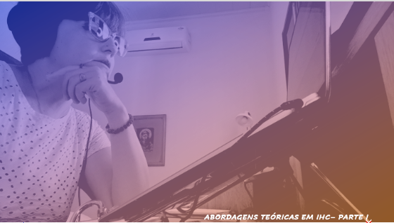
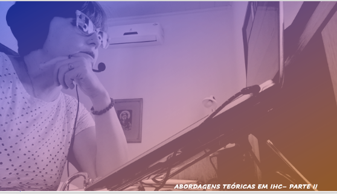
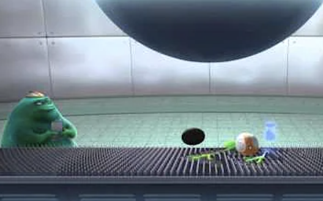
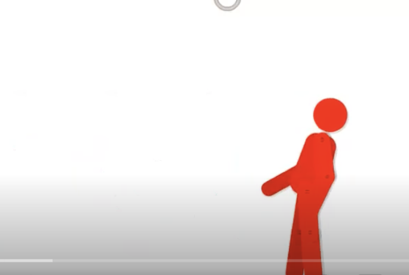

# Aula 03 - Interface Homem-Computador
## Tema aula - Abordagens Teóricas em IHC

### Materiais
- [Notas de aula Conceitos Básicos - Parte I e Parte II](abordagens_teoricas_em_ihc_completo.pdf)

### Videoaulas interface Homem-Computador -  Conceitos Básicos - Parte I e Parte II

### Material Complementar - O problema de uma interface -  O Abduzido PIXAR

### Material Complementar - Percepção Cores 

### Desenvolvimento Aula Abordagens Teóricas em IHC - Parte I: 

- [ ]  Abordagens que trazem contribuição para a área de IHC: Psicologia,Etnografia, Semiótica (conceitos iniciais)
- [ ]  Psicologia Experimental com a Lei de Hick-Human (organização elementos) e a Lei de Fitts (espaço a percorrer)
- [ ]  Psicologia Cognitiva Aplicada (Processador Humano de Informação)
- [ ]  Psicologia Cognitiva Aplicada (Princípios de Gestalt) 
- [ ]  Psicologia Cognitiva Aplicada (Percepção das Cores)
- [ ]  Engenharia Cognitiva (tradução variáveis psicológicas em variáveis físicas) exemplo torneira
- [ ]  Engenharia Cognitiva (Golfo de execução e golfo de avaliação)
- [ ]  Escher e a percepção

### Desenvolvimento Aula Abordagens Teóricas em IHC - Parte II: 

- [ ]  Engenharia Cognitiva (Modelo de Design, Imagem do sistema, Modelo do usuário)
- [ ]  Abordagens etnometodológicas (ação humana situada) 
- [ ]  Ação Planejada x Ação situada
- [ ]  Análise da conversação
- [ ]  Teoria da atividade
- [ ]  Cognição distribuída (amplia a semântica de cognitiva para abranger as interaçõa entre pessoas, recursos e materiais no ambiente)
- [ ]  Engenharia Semiótica (centrada na comunicação)
- [ ]  Metacomunicação ou Metamensagem
- [ ]  Os signos na engenharia semiótica (exemplo maçã)
- [ ]  Os tipos de signos (estáticos, dinâmicos e metalínguisticos)
