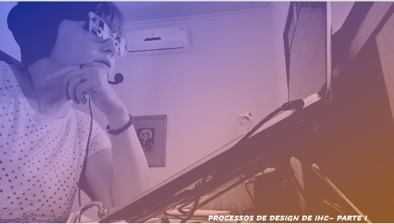
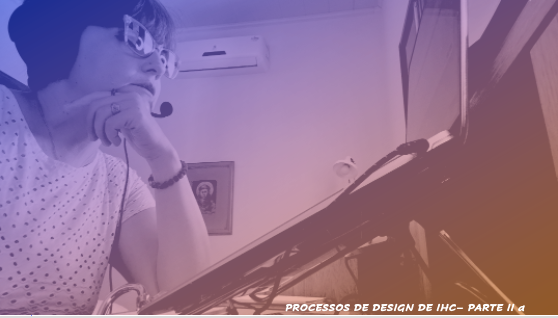
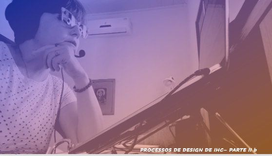

# Aula 04 - Interface Homem-Computador
## Tema aula - Processos de Design em IHC

### Materiais
- [Notas de aula Processos de Design de IHC - Parte I e Parte II](processos_design_ihc_completo.pdf)

### Videoaulas interface Homem-Computador -  Processos de Design em IHC - Parte I e Parte IIa e ParteIIb

### Desenvolvimento Processos de Design em IHC - Parte 1 

- [ ]  O que é Design
- [ ]  As atividades básicas em processos de design: Análise da Situação atual, Síntese de Intervenção, Avaliação da nova situação
- [ ]  Análise da Situação Atual: estudar e interpretar a situação atual; 
- [ ]  Síntese de Intervenção: planejar e executar uma intervenção na situação atual;
- [ ]  Avaliação da Nova situação: verificar o efeito da intervenção, comparando a situação analisada anteriormente com a nova situação, atingida após a intervenção.
- [ ]  Perspectivas de Design: Racionalismo Técnico (Enquadras situação em solução pronta) , Reflexão em ação (aprender o problema e propro uma solução)
- [ ]  Processos de Design de IHC: Principal características - execução atividades forma iterativa
- [ ]  Design dirigido pelo problema (maior tempo analisando problema
- [ ]  Design dirigido pela solução (maior tempo analisando a solução
- [ ]  Processos de design PARTE 1: Ciclo de vida simples, ciclo de vida em estrela, engenharia de usabilidade de Nielsen
- [ ]  Ciclo de vida simples: Centrado no usuário e versões interativas
- [ ]  Ciclo de vida em estrela: Não específica a atividade inicial, exigência de avaliação ao término de cada atividade.
- [ ]  Engenharia de usabilidade de Nielsen: atividades que devem ocorrer durante todo o ciclo de vida do produto

### Desenvolvimento Processos de Design em IHC - Parte 2 a e b

- [ ]  Processos de design PARTE 2: Design Contextual, Design Baseado em Cenários, Design Dirigido por Objetivos, Design Centrado na Comunicação
- [ ]  Design Contextual: Compreensão profunda das necessidades dos usuários.
- [ ]  Design Baseado em cenários: Histórias dos usuários realizando tarefas.
- [ ]  Design Dirigido por Objetivos
- [ ]  Design Centrado na Comunicação
- [ ]  Integração IHC e Engenharia de Software
- [ ]  Métodos ágeis e IHC
- [ ]  KAHOOT 
- [ ]  Atividade SIGAA
- [ ]  ClassDojo 
