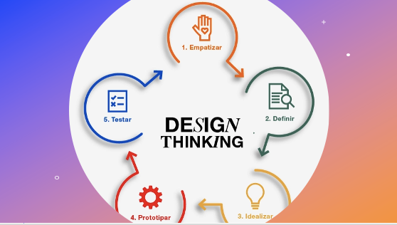

# Aula 05 - Interface Homem-Computador
# Tema aula - Identificação de necessidades dos usuários e requisitos de IHC

### Materiais
- [Notas de aula Identificação de necessidades dos usuários e requisitos de IHC - Parte I e Parte II](identificacao_necessidades_usuarios_requisitos_ihc.pdf)

### Videoaulas Interface Homem-Computador -  Processos de Design em IHC - Parte I e Parte IIa e ParteIIb

### Material Extra

### Desenvolvimento Identificação de Necessidades dos Usuários e Requisitos de IHC - Parte I 

- [ ]  Pontos principais envolvidos na coleta de dados: Definição dos objetivos, Relacionamento com participantes, Triangulação, Estudo piloto
- [ ]  Que dados coletar?
- [ ]  Primeiro deve-se entender quem é o usuário, não se concentrando nos melhores
- [ ]  Dados: o usuário, relação com a tecnologia, conhecimento do domínio do produto, conhecimento das tarefas, motivações e valores
- [ ]  De quem coletar? 
- [ ]  Fontes confiáveis, relevantes e que sejam representativas
- [ ]  Escolha da técnica, levar em consideração tipo de acesso a cada fonte de informação
- [ ]  Ética em pesquisa com pessoas
- [ ]  Como coletar? Entrevistas, Questionários, Grupos de foco, Brainstorming, Estudos de Campo, Investigação contextual
- [ ]  Entrevista: ESTRUTURADA, SEMIESTRUTURADA, NÃO ESTRUTURADA
- [ ]  Perguntas fechadas e abertas
- [ ]  Análise interparticipante e intraparticipante.

### Desenvolvimento Identificação de Necessidades dos Usuários e Requisitos de IHC - Parte II 

- [ ]  Como coletar? Questionários
- [ ]  Tipos de perguntas
- [ ]  Escala de Likert
- [ ]  Escala de diferenciais semânticos
- [ ]  Perguntas abertas
- [ ]  Grupos de foco
- [ ]  Brainstorming de necessidades e desejos dos usuários - Principais regras
- [ ]  Grupo de foco X Brainstorming - diferenças
- [ ]  Estudos de campo
- [ ]  Investigação contextual
- [ ]  Modelo mestre-aprendiz
- [ ]  Atividade prática valendo 200 XP e 3cristais
