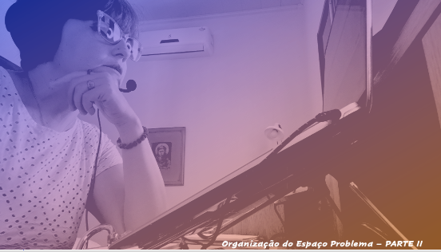

# Aula 06 - Interface Homem-Computador
# Tema aula - Organizaçãodo Espaço Problema

### Materiais
- [Notas de aula Organização do Espaço Problema - Parte I e Parte II](organizacao_espaco_problema_completo.pdf)

### Videoaulas Interface Homem-Computador -  Organização do Espaço Problema

### Organização do Espaço Problema - Parte I 

- [ ]  Como Registrar e organizar o aprendizado do designer, de modo a melhor compreender as informações obtidas na etapa de análise
- [ ]  Perfil de usuário, Personas, cenários e modelos de tarefas
- [ ]  Os modelos disponíveis permitem ao designer definir um recorte no mundo de interesse e com isso focar em um nível de detalhes
- [ ]  A atividade de análise seria a primeira parte da metamensagem: "Este é o meu entendimento, como designer, de quem você, usuário, é, do que aprendi  que você quer ou precisa fazer, de que maneiras prefere fazer, e por quê.
- [ ]  Perfil de usuário - Definir as principais categorias de usuários, dividir estas categorias por características semelhantes
- [ ]  Após definição dos perfis de usuário, definir as personas
- [ ]  Personas - Personagens fictícios, porém com características reais que representam um grupo de usuários e facilita o desenvolvimento de sistemas interativos com foco em uso
- [ ]  Definir claramento os objetivos das personas
- [ ]  DIFERENÇA ENTRE OBJETIVO e TAREFA - Tarefas mudam com a tecnologia, os objetivos são mais estáveis
- [ ]  Objetivos pessoais, corporativos e objetivos práticos
- [ ]  Cenários: Histórias sobre pessoas realizando atividades
- [ ]  Cenários podem utilizar as personas descritas como os atores
- [ ]  Exemplo do cadastro de projeto com co-orientador que não foi cadastrado no sistema 

### Organização do Espaço Problema - Parte II 

- [ ]  Análise de tarefas
- [ ]  Análise Hierárquica de tarefas, GOMS, Árvores de Tarefas Concorrentes
- [ ]  Análise Hierárquica de tarefas - Tem-se objetivos, subobjetivos e operações
- [ ]  Plano define a ordem que os subogjetivos devem ser alcançados
- [ ]  GOMS (Objetivos, Operadores, Métodos e Regras de Seleção)
- [ ]  KLM, CMN-GOMS e CPM-GOMS
- [ ]  KLM é a mais simples, limitada a um conjunto predefinido de operadores primitivos
- [ ]  CMN-GOMS tem uma hierarquia de objetivos e operadores (notação semelhante a pseudocódigo) - Exemplo encontrar sentido de uma rua no MAPS
- [ ]  CPM-GOMS - representa operadores cognitivos, perceptivos e motores, sendo baseado diretamento no processador humano de informações
- [ ]  Árvore de tarefas concorrentes (Tarefas do usuário, Tarefas do sistema, Tarefas interativas e Tarefas abstratas)

