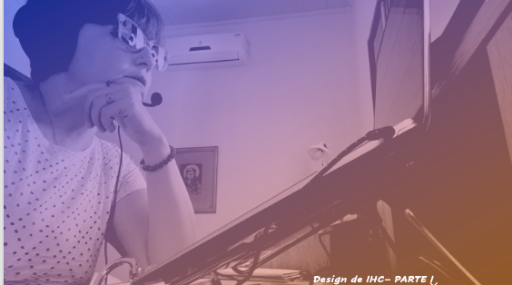
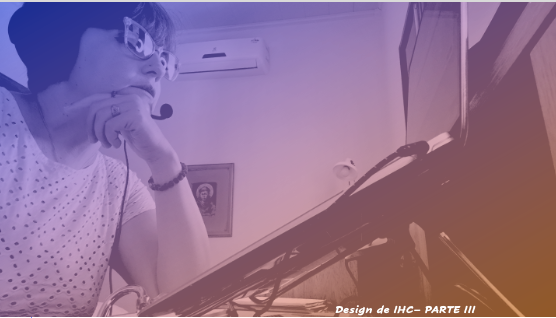

# Aula 07 - Interface Homem-Computador
# Tema aula - Design de IHC

### Materiais
- [Notas de aula Design de IHC - Parte I, Parte II e Parte III](design_de_ihc.pdf)

### Videoaulas Interface Homem-Computador -  Design de IHC

### Design de IHC - Parte I 

- [ ]  Desenvolvimento do projeto de intervenção, modelos referentes ao projeto de sistema interativo que será implementado
- [ ]  Apresentar quais são as representações utilizadas em IHC (cenários de problema, cenários de interação, personas, signos (conteúdo e expressão), mapa de objetivos, modelo de tarefas, modelo de interação, wireframe, esboços e protótipos
- [ ]  Cenários de interação, definir a interação as intervenções a serem realizadas, fornecem detalhes das ações do usuário e as respectivas respostas do sistema
- [ ]  Design centrado na comunicação 
- [ ]  Em design da interação o objetivo é completar a segunda parte da metamensagem (Sistema que projetei para você...)
- [ ]  Em design de interação a interação é vista como uma conversa entre designer e usuário, durante a conversa usuário-sistema
- [ ]  Definir o que é conversa e como especificar uma conversa entre usuário e designer
- [ ]  Mapa de objetivos dos usuários
- [ ]  Objetivos finais, objetivos instrumentais
- [ ]  Objetivos instrumentais diretos (AGORA) Objetivos instrumentais indiretos (EM UM FUTURO)
- [ ]  Exemplo de mapa de objetivos PROFESSOR E ALUNO sistema de divulgação de material, atividades e notas de uma disciplina.
- [ ]  Esquema conceitual de signos - Como extrair signos de uma especificação de conversa?
- [ ]  Signo entidade, signo atributo
- [ ]  Signo de domí

### Design de IHC - Parte II  

- [ ]  Análise de tarefas

### Design de IHC - Parte III 
- [ ]  Análise de tarefas
