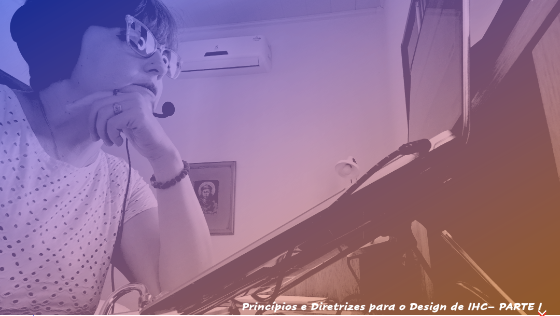
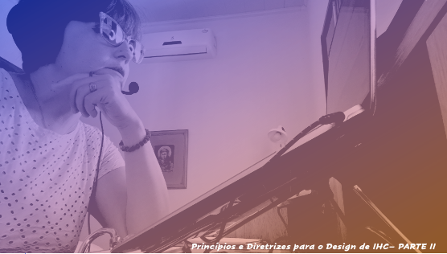

# Aula 08 - Interface Homem-Computador
# Tema aula - Princípios e Diretrizes para o Design de IHC

### Materiais
- [Notas de aula Princípios e Diretrizes para o Design de IHC - Parte I e Parte II](principios_diretrizes_design_ihc.pdf)

### Videoaulas Interface Homem-Computador -  Princípios e Diretrizes 

### Princípios e Diretrizes para o Designde IHC - Parte I 

- [ ]  Desenvolvimento do projeto de intervenção, modelos referentes ao projeto de sistema interativo que será implementado

### Princípios e Diretrizes para o Designde IHC - Parte II  

- [ ]  Prevenção e recuperação de rupturas comunicativas

