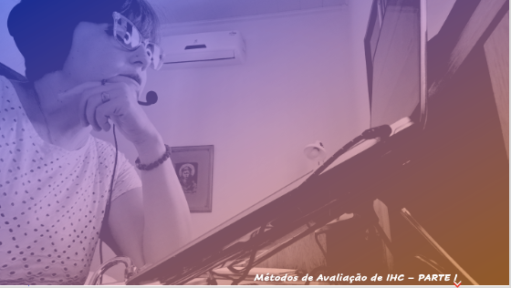
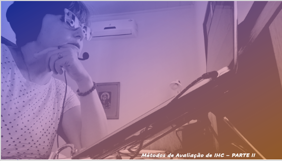
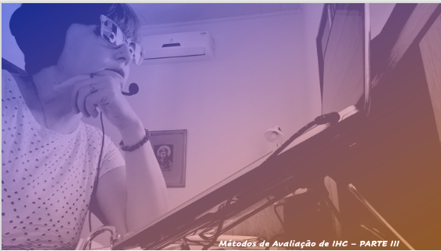
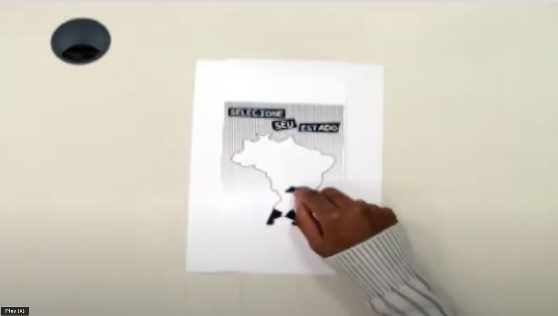

# Aula 10 - Interface Homem-Computador
# Tema aula - Métodos de Avaliação de IHC

### Materiais
- [Notas de aula Métodos de Avaliação de IHC - Parte I, Parte II e Parte III](metodos_avaliacao_ihc.pdf)

### Videoaulas Interface Homem-Computador -  Planejamento Avaliação IHC

### Vídeo a importância de um bom planejamento

### Métodos de Avaliação de IHC - Parte I 

- [ ]  A importância da avaliação no processo de desenvolvimento

### Métodos de Avaliação de IHC - Parte II 

- [ ]  ONDE COLETAR DADOS SOBRE EXPERIÊNCIAS DE USO: Caso o objetivo seja avaliar a adaptação da solução ao ambiente real do usuário, deve-se conduzir uma avaliação no contexto de uso real

### Métodos de Avaliação de IHC - Parte III 

- [ ]  COMO AVALIAR? Preparação, coleta de dados, interpretação, consolidação, relato dos resultados
